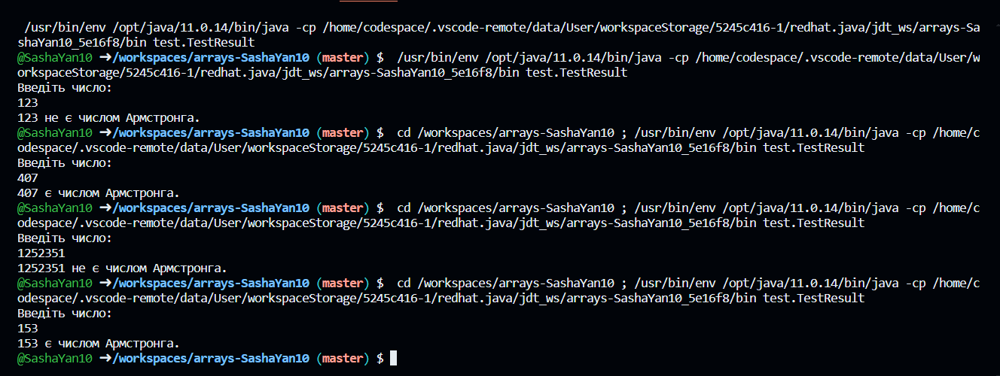

# Завдання 13 – Перевірте чи є задане число числом Армстронга

## Код класу Exercise:
```java
package domain;

public class Exercise {
    public static boolean isArmstrong(int number) {
        int[] num = getDigits(number); // отримуємо масив цифр числа
        int n = num.length; // кільість цифр числа
        int result = 0; // тут зберігається сума потенційних чисел Армстронга

        for (int i = 0; i < num.length; i++) { // обчислюється сума чисел, піднесених до n
            int digit = num[i];
            result += Math.pow(digit, n);
        }
        return result == number; // порівнюємо результат з початковим числом для визначення числа Армстронга
    }

    public static int[] getDigits(int number) { // отримання масиву цифр числа
        int length = String.valueOf(number).length(); // визначення кількість цифр у числі
        int[] num = new int[length]; // створення масиву для зберігання цифр
        int index = 0; // індекс поточної цифри в масиві

        while (number != 0) { // розбивання числа на цифри та додавання їх у масив
            int digit = number % 10; // отримння останньої цифри числа
            num[index++] = digit; // додавання цифри до масиву
            number /= 10; // відкидання останньої цифри числа
        }
        return num; // повертання масиву цифр числа
    }
}
```

## Код класу TestResult:
```java
package test;

import domain.Exercise;
import java.util.Scanner;

public class TestResult {

    public static void main(String[] args) {
        Scanner scanner = new Scanner(System.in);
        System.out.println("Введіть число: "); 
        int number = scanner.nextInt(); // ввід числа
        scanner.close();

        if (Exercise.isArmstrong(number)) { // перевіряємо, чи є число числом Армстронга
            System.out.println(number + " є числом Армстронга.");
        } else {
            System.out.println(number + " не є числом Армстронга.");
        }
    }
}
```
## Результат:
